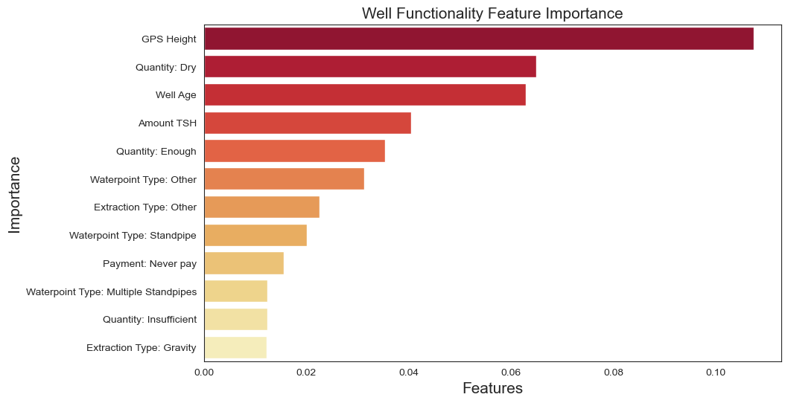
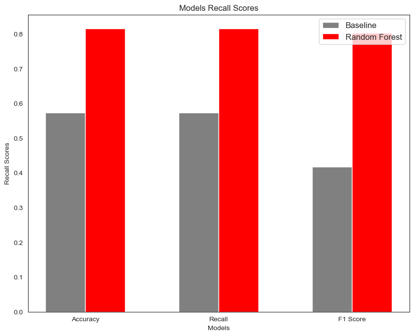
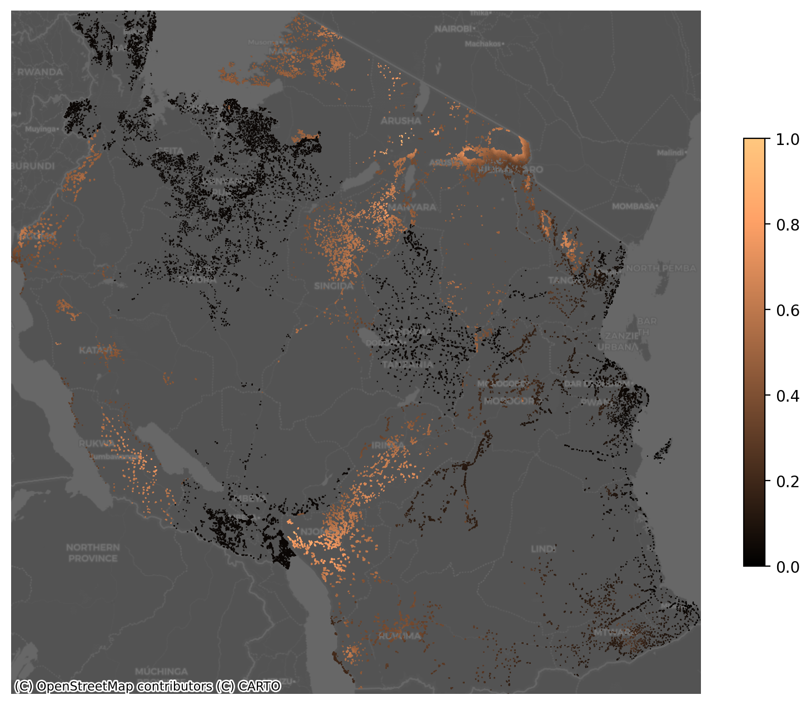
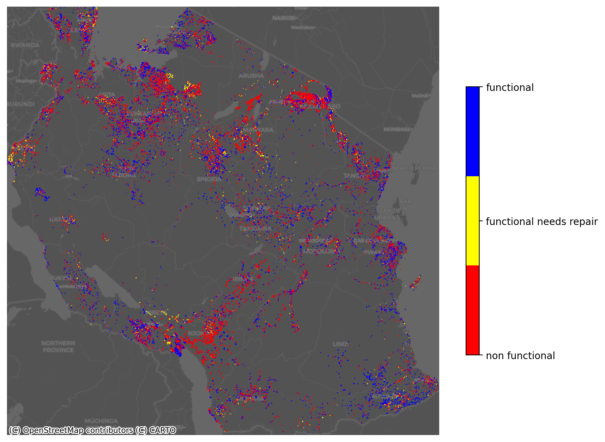

# Tanzanian-Water-Wells

# 
 Phase 3 Project: Tanzanian Water Wells 

   
  By: Keanan Ginell
# Business Overview
 Having access to water is a basic human right. In poorer countries this is unfortunately a problem people face everyday. To ensure the people of Tanzania have access to water, the government of Tanzania has tasked me with building a model to help predict if a well is functioning and which wells need repair.
The stakeholders in this problem are the Tanzanian governement, citizens of tanzania, and those working in repairing the water wells.

# Method
To do this I first developed a baseline model using a dummy model, I then aanalyzed several other models includeing a decision tree, logistic regression, and random forest. After determing the random forest model performs the best I optimized the parameters and created my final model with a accuacy of 81% compared to the baseline model of 54%

# Results

# Wells gps height

# Wells Functionality

   
 # Conclusion

When comparing the accuracy and recall scores from the baseline model to the final model, 

Baseline:
- Accuracy - 57%
- Recall - 57%

Final Model:
- Accuracy - 81%
- Recall - 81%

The final model used a random forest with optimized parameters. This model can be used to predict is a well is functional, non functional, or functional and needs repair. Safe access to clean water is a basic human right, these wells are important to ensuring that this human right is met. My model can help the Tanzanian government determine if a well needs to be fixed. 

